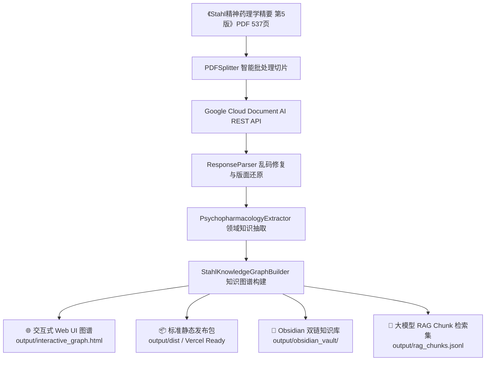

# 🧠 Stahl 精神药理学全景知识图谱与结构化解析系统
### *Stahl's Essential Psychopharmacology (5th Edition) · Panorama Knowledge Graph & Document AI Pipeline*

[](https://www.python.org/)
[](https://github.com/astral-sh/uv)
[](https://cloud.google.com/document-ai)
[](https://visjs.org/)
[](https://obsidian.md/)
[](LICENSE)

---

## 📖 项目简介

本项目针对精神医学领域权威巨著**《Stahl 精神药理学精要（第 5 版）》**（全书 537 页），构建了从**“底层视觉 OCR 结构化解析”**到**“顶层全景药理知识图谱与交互式 Web 应用”**的端到端全栈系统：

1. **解决巨著解析痛点**：突破大型医学 PDF 内嵌字形编码（ToUnicode 映射）严重损坏引起的乱码问题，基于 **Google Cloud Document AI REST API** 纯视觉 OCR 与智能切片算法，精准提取全书中英文专业术语、受体代号、生化反应式与图注关联。
2. **全域药理机制知识图谱**：构建覆盖全书 14 章的 **187 个医学实体与 384 条机制证据链**，涵盖精神药物、受体靶点、神经通路、疾病表型、不良反应与药物大类。
3. **高精交互式 Web 探索平台**：开创**“单点级联裂变探索”**与**“证据闭环子图连接”**，配备 20+ 项前沿专病场景预设、动力学防挤飞布局、高精分子结构式/药片素材与全维度临床药理卡片。

---

## 🌟 核心特性与架构



### 1. 🌐 高精交互式 Web 知识图谱应用
* **单点级联扩散探索 (Cascade Exploration)**：默认以核心突破性药物（如艾司氯胺酮 Spravato®）单点开屏，点击任意节点动态裂变扩散其 1 度/2 度关联靶点与回路，避免信息过载。
* **以相互关系为证据紧密连接 (Evidence-Linked Subgraphs)**：选择任一实体类别（如受体、疾病或不良反应），系统自动拉出与之直接发生药理作用的上下游药物、靶点与回路，杜绝“孤立节点”。
* **20+ 核心专病与前沿机制场景预设**：一键透视难治抑郁 (TRD)、急性自杀危机 (MDSI)、产后抑郁 (PPD)、双重食欲素拮抗 (DORA)、微量胺受体 (TAAR1)、昼夜节律 (SCN/阿戈美拉汀)、ADHD 前额叶回路、强迫症 CSTC 环路等。
* **高精医学素材与临床药理卡片**：全面无缝接入并共用 `Shittim Chest · Pharma System` 专业医学素材库（包含速开朗®实物喷雾剂、专注达® OROS 渗透泵缓释片、优宁睿®咀嚼片、贯注®、氯硝西泮、普瑞巴林、精神药品专有标识、NMDA 拮抗图解、昼夜节律及 2D 分子结构式等 180+ 项高精资产），抽屉式展示中英文药名、官方商品名、受体亲和力、药理机制详述与双向跳转链接。
* **三维动态布局引擎**：
  * 💫 **柔性松弛 (Barnes-Hut)**：平滑阻尼动力学，彻底消除节点重叠与挤飞现象。
  * 🎯 **同心聚类 (Concentric Cluster)**：以受体为核心、药物居中、疾病与通路向外辐射的同心环状排布。
  * 🌲 **机制层级树 (Hierarchical UD)**：自上而下的药理传导与病理演进树形图。
* **实时全文检索与相机平滑飞越**：支持中英文学名、商品名（如“京诺宁”、“速开朗”、“达卫可”）模糊匹配与平滑缩放聚焦。

### 2. ⚡ Document AI REST API 高性能解析引擎
* **原生 REST API 封装**：支持 `:process` 同步在线处理与 `:batchProcess` 异步批量任务。
* **智能切片与断点续传**：自动分块与局部页码渲染，本地 JSON 响应持久化缓存，杜绝重复 API 消费。
* **高精度 OCR 视觉模型**：彻底绕过损坏的 PDF 字体编码，完整还原中英文专业术语与图注。

### 3. 📚 多格式科研与大模型数据交付
* **交互式独立网页**：`output/interactive_graph.html`（离线本地双击即开）。
* **静态部署包**：`output/dist/`（包含完整 assets 资源、`vercel.json` 与 `knowledge_graph.json`）。
* **Obsidian 双链知识库**：`output/obsidian_vault/`（支持 Graph View 与双向链接 `[[...]]`）。
* **大模型 RAG 数据集**：`output/rag_chunks.jsonl`（包含精确页码、受体/药物元数据）。

---

## 🧬 20+ 核心专病与前沿机制场景矩阵

| 场景板块 | 核心药物 / 靶点 | 关键神经回路 / 药理机制 | 临床应用场景 |
|---|---|---|---|
| **自杀干预 & 难治抑郁** | 艾司氯胺酮 (速开朗®)、碳酸锂 | NMDA 阻断 → AMPA 激活 → mTORC1/BDNF 突触再生 | 急性自杀危机 (MDSI)、难治性抑郁 (TRD) |
| **GABA-A α1 部分变构** | 地达西尼 (京诺宁®) | GABA-A α1 亚型部分正向变构 (pPAM，40-50% 内在活性) | 失眠障碍 (无宿醉嗜睡、无反跳与成瘾) |
| **双重食欲素拮抗 (DORA)** | 沃诺雷生 (Vorzzz)、法赞雷生、莱博雷生 (达卫可®) | 阻断 OX1R/OX2R 下丘脑觉醒中枢信号 | 生理性睡眠结构重塑、慢波睡眠维护 |
| **新型促醒机制** | 替洛利生 (铧可思®)、莫达非尼 | H3 自身受体拮抗脱抑制促组胺爆发 / DAT 抑制 | 发作性睡病 (猝倒发作与日间过度嗜睡) |
| **ADHD 前额叶调控** | 赖右苯丙胺、哌甲酯、维洛沙嗪、胍法辛 | DAT/NET 抑制、α2A 激动强化前额叶突触信噪比 | 注意缺陷多动障碍 (ADHD)、执行功能障碍 |
| **产后抑郁特异性突破** | 佐拉诺酮 (Zurzuvae)、别孕烷醇酮 | 突触外 GABA-A δ 亚基神经类固醇变构调节 (Tonic 抑制) | 产后抑郁 (PPD)、重度抑郁障碍 |
| **SNDRI 三重再摄取** | 托鲁地文拉法辛 (若欣林®) | 5-HT / NE / DA 均衡三重再摄取抑制 | 快感缺失、认知迟滞与重度抑郁 |
| **非多巴胺抗精神病** | 乌洛他隆 (Ulotaront)、匹莫范色林 | TAAR1 细胞内激动负反馈 / 5-HT2A 反向激动 | 精神分裂症 (零 EPS、零催乳素升高)、PDP |
| **昼夜生物节律** | 阿戈美拉汀 (韦度®)、雷美替胺 | MT1/MT2 激动 + 5-HT2C 拮抗 (MASSA 机制) | 视交叉上核 (SCN) 生物钟重塑、伴失眠抑郁 |
| **认知与阿尔茨海默病** | 仑卡奈单抗 (乐意保®)、多奈哌齐、美金刚 | Aβ 原纤维清除 / AChE 抑制 / NMDA 兴奋毒性拮抗 | 早期阿尔茨海默病 (AD)、血管性认知障碍 |
| **强迫症 CSTC 环路** | 氟伏沙明 (兰释®)、氯米帕明 | SERT 强效抑制 + Sigma-1 伴侣受体激动 | 皮质-纹状体-丘脑-皮质 (CSTC) 环路脱敏 |
| **创伤恐惧消退** | 哌唑嗪、普萘洛尔 | α1 肾上腺素中枢阻断 / β 受体恐惧记忆去巩固 | 创伤后应激障碍 (PTSD) 噩梦与警觉 |
| **成瘾奖赏回路** | 伐尼克兰 (畅沛®)、纳曲酮、双硫仑 | α4β2 nAChR 部分激动 / μ-阿片受体阻断 / ALDH 抑制 | 戒烟、酒精使用障碍 (AUD)、阿片脱瘾 |

---

## 🚀 快速使用指南

### 1. 环境准备与依赖安装

项目采用现代 Python 包管理工具 **`uv`** 进行极速依赖安装：

```bash
# 1. 克隆代码仓库
git clone https://github.com/Mirai0331/stahl-psychopharmacology-graph.git
cd stahl-psychopharmacology-graph

# 2. 一键同步安装虚拟环境与全部依赖
uv sync
```

### 2. 配置 Google Cloud Document AI 凭据

复制环境变量模板并填入您的 GCP 项目参数：

```bash
cp .env.example .env
```

在 `.env` 中配置：
```ini
GCP_PROJECT_ID=your-gcp-project-id
GCP_LOCATION=us
GCP_PROCESSOR_ID=your-docai-processor-id
# 可选：GOOGLE_APPLICATION_CREDENTIALS="C:/path/to/credentials.json"
```

---

## 💻 命令行操作手册

### 1. 查看 PDF 元数据与切片规划
```bash
uv run python src/stahl_document_ai/main.py info
```

### 2. 解析指定页码范围（高精 OCR 与机制抽取）
```bash
# 试运行前 5 页进行效果验证
uv run python src/stahl_document_ai/main.py process-range --start-page 1 --end-page 5

# 解析全书 537 页完整内容
uv run python src/stahl_document_ai/main.py process-range --start-page 1 --end-page 537
```

### 3. 一键重新生成知识图谱与 Web 交互应用
```bash
uv run python src/stahl_document_ai/main.py build-knowledge-graph --output-dir output
```

### 4. 打包静态分发包 (Vercel / GitHub Pages Ready)
```bash
uv run python scripts/build_dist.py
```

### 5. 执行全套单元测试与功能验证
```bash
# 执行自动化单元测试
uv run pytest -v

# 验证知识图谱与 Web 页面功能一致性
uv run python scripts/verify_web_functionality.py
```

---

## 🌐 网页功能与本地预览

### 方式 A：直接双击打开（离线即用）
直接在文件管理器中双击打开：
👉 [`output/interactive_graph.html`](output/interactive_graph.html)

### 方式 B：启动本地 HTTP 服务
```bash
uv run python -m http.server 8000 --directory output
```
在浏览器中访问：`http://localhost:8000/interactive_graph.html`

### 方式 C：部署至 Vercel / GitHub Pages
`output/dist` 目录为标准静态站点结构，直接推送到 GitHub 或导入 Vercel 即可秒级上线：
* 包含 `index.html`、`assets/` 高清素材目录、`knowledge_graph.json` 及 `vercel.json`。

---

## 📂 项目结构规范

```text
stahl-psychopharmacology-graph/
├── output/                         # 产物生成目录
│   ├── interactive_graph.html      # 🌐 独立交互式知识图谱 Web 应用
│   ├── knowledge_graph.json        # 📊 结构化知识图谱 JSON (187点/384边)
│   ├── assets/                     # 🖼️ 高精分子结构式 (SVG) 与药片素材
│   ├── dist/                       # 🚀 Vercel / Pages 静态发布目录
│   └── obsidian_vault/             # 💎 Obsidian 双链知识库 (.md Vault)
├── src/
│   └── stahl_document_ai/
│       ├── main.py                 # 🖥️ CLI 命令行核心入口
│       ├── config.py               # ⚙️ 系统配置与环境变量管理
│       ├── client/                 # ☁️ Document AI REST API 客户端与认证
│       ├── processors/
│       │   ├── pdf_splitter.py     # 📑 PDF 智能切片与页面渲染
│       │   ├── response_parser.py  # 🧩 Document AI 响应解析与乱码纠偏
│       │   ├── graph_builder.py    # 🧬 精神药理学全景图谱构建器
│       │   ├── interactive_graph_generator.py # 🎨 交互式 Web UI 生成引擎
│       │   └── obsidian_exporter.py# 💎 Obsidian 笔记导出器
│       └── exporter.py             # 📝 Markdown / JSON / RAG 数据集导出
├── scripts/
│   ├── build_dist.py               # 📦 静态发布包一键构建打包脚本
│   ├── generate_data.py            # 📊 14 章全域药理学数据源定义
│   └── verify_web_functionality.py # 🧪 知识图谱与 Web 页面功能验证测试
├── docs/                           # 📄 设计方案与交付报告
├── tests/                          # 🧪 Pytest 测试用例
├── pyproject.toml                  # 📦 项目依赖与元数据声明 (uv)
└── README.md                       # 📘 项目全景技术文档
```

---

## 🔬 药理学术语与中英文规范

为确保临床实践与学术科研的严谨性，图谱遵循以下原则：
1. **中文官方通用学名与官方商品名在先**：如 `艾司氯胺酮 (速开朗® / Spravato)`、`地达西尼 (京诺宁®)`、`莱博雷生 (达卫可®)`、`替洛利生 (铧可思®)`、`托鲁地文拉法辛 (若欣林®)`、`伏硫西汀 (心达悦®)`。
2. **证据闭环连接**：每个药物均绑定受体结合模式（激动、部分激动、拮抗、PAM、抑制）与神经环路调控机制，拒绝孤立数据。
3. **前沿机制与经典药理融合**：从第一代典型抗精神病药到最新 TAAR1 激动剂 (乌洛他隆)、神经类固醇 (佐拉诺酮)、DORA 类促眠药全谱覆盖。

---

## 📄 License

本项目基于 [MIT License](LICENSE) 开源发布。